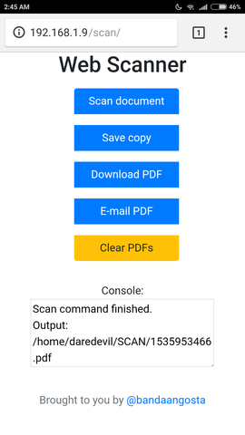
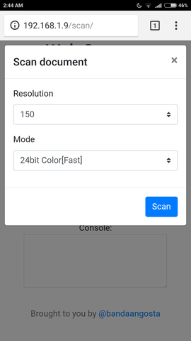
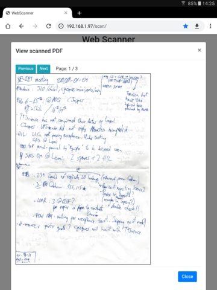

# Web Scanner

Gives your typical flatbed USB scanner a simple, yet very efficient web interface.

   

## Quick Start

Run the application:

    make run

And open it in the browser at [http://127.0.0.1:5000/](http://127.0.0.1:5000/)

## Prerequisites

This is built to be used with Python 3. Update `Makefile` to switch to Python 2 if needed.

Some Flask dependencies are compiled during installation, so `gcc` and Python header files need to be present.
For example, on Ubuntu:

    apt install build-essential python3-dev

## Development environment and release process

 - create virtualenv with Flask and Web Scanner installed into it (latter is installed in
   [develop mode](http://setuptools.readthedocs.io/en/latest/setuptools.html#development-mode) which allows
   modifying source code directly without a need to re-install the app): `make venv`

 - run development server in debug mode: `make run`; Flask will restart if source code is modified

 - run tests: `make test` (see also: [Testing Flask Applications](http://flask.pocoo.org/docs/0.12/testing/))

 - create source distribution: `make sdist` (will run tests first)

 - to remove virtualenv and built distributions: `make clean`

 - to add more python dependencies: add to `install_requires` in `setup.py`

 - to modify configuration in development environment: edit file `settings.cfg`; this is a local configuration file
   and it is *ignored* by Git - make sure to put a proper configuration file to a production environment when
   deploying

## Deployment

See [Flask Deployment Options](http://flask.pocoo.org/docs/1.0/deploying/) for a number of ways to deploy your web application. For example, by using Apache and mod_wsgi.

## Deployment with Docker (Raspbian + Flask development server)

Install Docker (in this example, on a Raspberry Pi) following the [Documentation](https://docs.docker.com/install/linux/docker-ce/debian/#upgrade-docker-after-using-the-convenience-script).
In the same folder as the Dockerfile, run the following to build the image:

    docker build -t webscanner .

You can test the web application is working by running the following and visiting the IP address of your device on a browser:

    docker run -it --rm -p 80:5000 --name webscanner_container webscanner

Leave it running in the background:

    docker run -d --rm -p 80:5000 --name webscanner_container webscanner

Leave it running in the background and restart automatically, particularly on server reboot:

    docker run -d -p 80:5000 --restart unless-stopped --name webscanner_container webscanner

## Deployment with Docker (Alpine + nginx + uwsgi)

A more robust method for deployment on x86 machines is the following:

    docker build -t webscanner -f Dockerfile.nginx-uwsgi .
    docker run -d --restart=always -p 80:80 --name my_webscanner webscanner

In this case, commands can be sent from the container to the host through SSH. For example, redefine in instance/setting.py, scanner commands as follow. In this case, we need to run the commands directly on the host because scanner drivers are already installed on the host (Ubuntu/Debian) and not available for the Linux distro of the container (Alpine). Although there are other solutions for this particular problem (like using a Debian-based nginx/uwsgi image and installing the scanner drivers in it), this is also an interesting experiment of container to host communication that could be applied to other projects as well:

    COMMAND_SCAN = 'ssh -o "StrictHostKeyChecking=no" daredevil@172.17.0.1 /home/daredevil/dev/webscanner/bash/scanDo.sh'
    COMMAND_CLEAR = 'ssh -o "StrictHostKeyChecking=no" daredevil@172.17.0.1 /home/daredevil/dev/webscanner/bash/scanClear.sh'
    COMMAND_SAVE = 'ssh -o "StrictHostKeyChecking=no" daredevil@172.17.0.1 /home/daredevil/dev/webscanner/bash/scanSave.sh'
    COMMAND_SCP_COPY = 'scp -o "StrictHostKeyChecking=no" daredevil@172.17.0.1:{} {}'.format(PDF_FILE_PATH, PDF_FILE_PATH_CONTAINER)

In order for this method to work, password-less login must be enabled as followed:

    docker exec -it my_webscanner ssh-keygen
    docker exec -it my_webscanner cat /root/.ssh/id_rsa.pub >> ~/.ssh/authorized_keys

